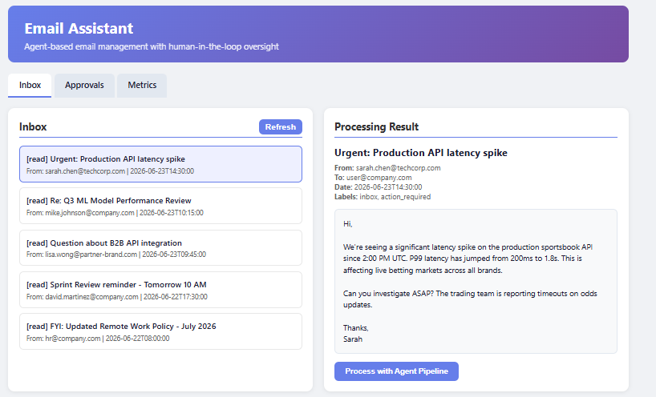
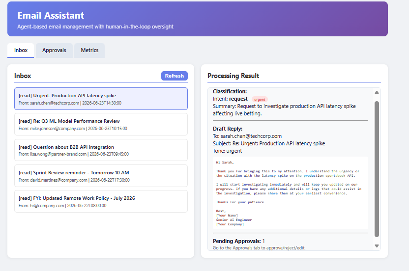
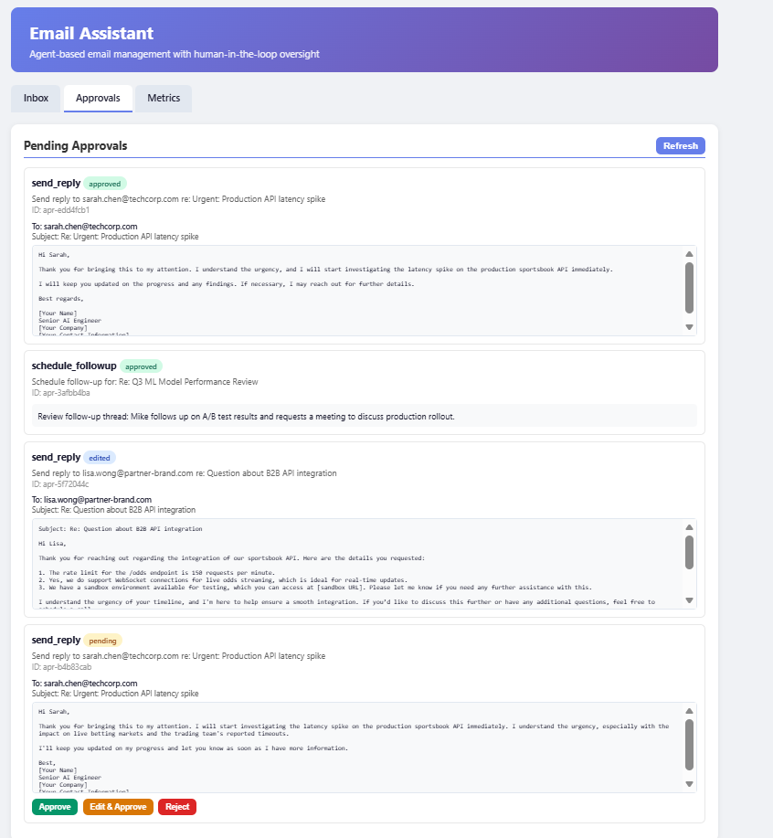
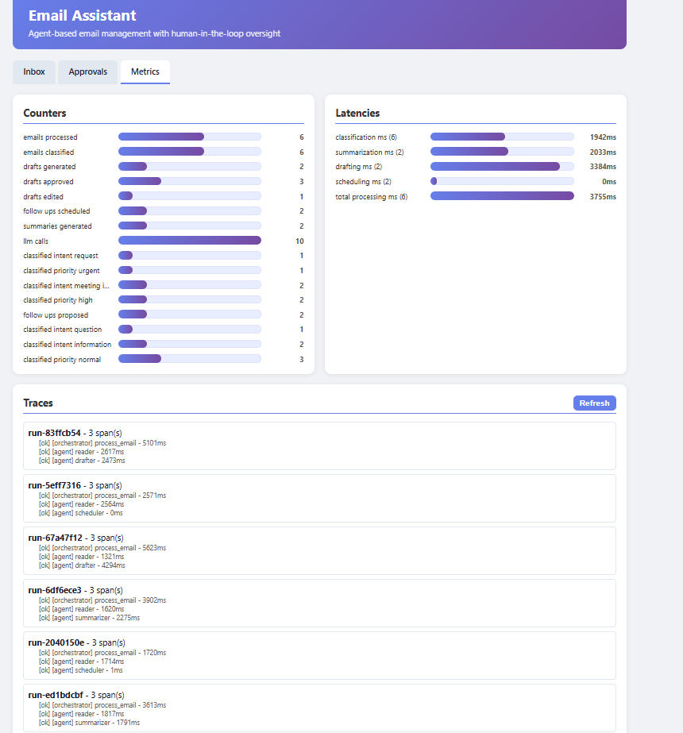

# 📧 Intelligent Email Assistant

An agentic email management system built with **LangGraph**, **FastAPI**, and a **hybrid long-term memory store**. It reads, classifies, summarizes, drafts replies, and schedules follow-ups — all with human-in-the-loop oversight.

## Evaluation / Known Tradeoffs

This repository is a take-home prototype optimized for clear architecture, deterministic demos, and testability:

- **Mocked integrations**: Mail and calendar/task operations use in-memory mock adapters (`app/tools/mail_api.py`, `app/tools/calendar_api.py`) rather than Gmail, Outlook, or Google Calendar APIs.
- **In-memory runtime state**: Inbox state, sent emails, approvals, metrics, traces, calendar events, and LangGraph checkpoints are process-local. Long-term memory is persisted separately via the JSON/optional ChromaDB store.
- **Fallback behavior without an OpenAI key**: If `OPENAI_API_KEY` is not configured, is a placeholder, or `LLM_ENABLED=false`, the system uses rule-based classification and template-based summary/draft fallbacks for reliable local execution.
- **No authentication**: API endpoints are intentionally unauthenticated for the demo; production would require auth, authorization around approval execution, stricter CORS, and secret management.
- **Production path**: Replace mocks with real mail/calendar providers, move runtime state to PostgreSQL/Redis, use managed vector search or ChromaDB with embeddings, and add managed observability such as OpenTelemetry/Prometheus/LangSmith.

## 🏗️ Architecture Overview

```
┌─────────────────────────────────────────────────────────────────┐
│                        FastAPI Layer                            │
│  /inbox  /approvals  /memory  /metrics  /traces                │
├─────────────────────────────────────────────────────────────────┤
│                   LangGraph Orchestrator                        │
│  ┌──────────┐  ┌────────────┐  ┌─────────┐  ┌───────────┐     │
│  │  Reader   │→│ Summarizer │→│ Drafter  │→│ Scheduler  │     │
│  │  Agent    │  │   Agent    │  │  Agent   │  │   Agent    │     │
│  └──────────┘  └────────────┘  └─────────┘  └───────────┘     │
├─────────────────────────────────────────────────────────────────┤
│                        Tools Layer                              │
│  Mail API (mock) │ Calendar API (mock) │ Classifier │ Memory Store │
├─────────────────────────────────────────────────────────────────┤
│                    Memory & Observability                       │
│  Short-term (State) │ Long-term Memory │ Logs │ Traces        │
└─────────────────────────────────────────────────────────────────┘
```

The system uses a **StateGraph** (LangGraph) as the orchestrator. Each email flows through:

1. **Reader Agent** — Fetches the email, retrieves relevant long-term memory (contacts, preferences, org facts), classifies intent/priority using an LLM with structured output (with rule-based fallback), and applies labels.

2. **Routing** — Conditional edges route to the appropriate downstream agent(s) based on classification:
   - Urgent requests/questions → **Drafter**
   - Information/FYI → **Summarizer**
   - Meeting invites/follow-ups → **Scheduler**
   - Complex requests → **Summarizer** → **Drafter**

3. **Summarizer Agent** — Generates structured thread summaries (key points, action items, sentiment) using the LLM.

4. **Drafter Agent** — Composes contextual reply drafts enriched with memory context. Creates an `ApprovalRequest` for HITL review.

5. **Scheduler Agent** — Determines follow-up timing based on priority and user preferences. Creates a follow-up proposal and `ApprovalRequest`; the calendar event is created only after human approval.

All outgoing actions (sending emails, scheduling) require explicit human approval via the `/approvals` API.

## 📋 Memory Strategy

### Short-Term Memory
- Implemented as the **LangGraph `AgentState` TypedDict** — a structured dict that flows through the graph
- Contains: message history, current email, classification, draft reply, pending approvals, memory context
- Scoped to a single processing run; automatically managed by LangGraph's state management
- Includes helper utilities for sliding context windows and state summarization; current prompts use compact email/thread context for deterministic demo behavior

### Long-Term Memory
- **Hybrid memory store** with an always-available JSON/keyword backend and optional ChromaDB vector search. When an OpenAI API key is configured, ChromaDB uses `text-embedding-3-small` embeddings for true semantic retrieval — no local model download required. It contains three collections:
  - **Preferences** — User preferences (reply tone, urgency thresholds, scheduling preferences)
  - **Contacts** — Known contacts with roles, organizations, and relationship context
  - **Org Facts** — Organizational knowledge (team policies, project info, technical architecture)
- **Search / recall** retrieves relevant memory at processing time, enriching agent context. When an OpenAI API key is provided, ChromaDB is automatically enabled with OpenAI embeddings for semantic search; otherwise the JSON/keyword backend is used.
- Memory is persisted to `memory_store.json` under the configured `CHROMA_PATH` and can be updated via the `/memory` API. In Docker, this path is backed by the `chroma_data` volume.
- The memory implementation is intentionally swappable: JSON store for deterministic demos, ChromaDB/vector DB for production-style semantic retrieval.

### Memory Flow
```
Email arrives → Reader retrieves relevant contacts, preferences, org facts
             → Memory context injected into classification and drafting prompts
             → User feedback (approval edits) updates long-term preferences
             → Future drafts adapt to learned tone, style, and rejection reasons
```

### Feedback Loop (Behavior Evolution)
The system **evolves over time** based on human decisions:
- **Edited drafts** → The system detects tone changes and body rewrites, storing them as preferences for future drafting.
- **Rejection feedback** → User-provided reasons are persisted, informing future classification and routing decisions.
- **Style learning** → When a user significantly rewrites a draft (>50% change), the rewritten text is stored as a reply style example.

This ensures the assistant becomes more aligned with the user's communication style with each interaction.

## 🔍 Observability & Monitoring

### Structured Logging (structlog)
- JSON-formatted logs with ISO timestamps
- **Correlation IDs** propagated via FastAPI middleware (`X-Correlation-ID` header)
- Agent nodes, key tool operations, and API requests are logged with contextual metadata
- Log levels configurable via `LOG_LEVEL` environment variable

### Processing Traces
- Custom **in-memory span-based tracing** for each orchestrator run
- Records orchestrator and agent-node spans with durations for the current processing pipeline
- Trace data exposed via `GET /traces`
- Each recorded span captures: type (`orchestrator` or `agent`), name, duration_ms, status, metadata
- Tool operations and LLM activity are currently visible through structured logs and metrics counters, not as separate trace spans

### Metrics
- **In-memory counters**: emails_processed, emails_classified, summaries_generated, drafts_generated, approvals_approved/rejected/edited, send_replies_approved/rejected/edited, follow_ups_proposed/approved/rejected/edited/scheduled, errors, LLM calls/fallbacks
- **Classification breakdowns**: dynamic counters such as `classified_intent_information`, `classified_intent_request`, `classified_priority_urgent`, and `classified_priority_normal`
- **Latency histograms**: classification, summarization, drafting, scheduling, total processing (with avg, min, max, p50)
- Metrics snapshot exposed via `GET /metrics` and visualized as bar charts in the Web UI Metrics tab

### Sample Log Output
```jsonl
{"event": "email_classified", "email_id": "email-001", "intent": "request", "priority": "urgent", "confidence": 0.95, "level": "info", "timestamp": "2026-06-23T14:35:01Z", "correlation_id": "abc123"}
{"event": "drafter_agent_completed", "email_id": "email-001", "approval_id": "apr-x7y8z9", "tone": "urgent_professional", "level": "info", "timestamp": "2026-06-23T14:35:03Z"}
```

## 🚀 Quick Start

### Option A: Docker (Recommended — no local setup needed)

```bash
# 1. Clone the repo
git clone <repo-url> && cd betsson_assessment

# 2. Set your OpenAI API key (optional, but recommended for LLM-powered replies)
cp .env.example .env
# Edit .env → set OPENAI_API_KEY=sk-...

# 3. Start the service
docker compose up --build

# The API is now running at http://localhost:8000
# Interactive docs at http://localhost:8000/docs
# Web UI at http://localhost:8000/ui
# JSON health/status at http://localhost:8000/health
```

If you use **Docker Desktop**, click the published port link for `8000:8000`; browser requests to `http://localhost:8000/` automatically redirect to the Web UI at `/ui`. For the original JSON health/status response, open `http://localhost:8000/health`.

```bash
# Run the full demo (starts server + runs demo automatically)
docker compose --profile demo up --build

# Or run server and demo separately:
docker compose up --build          # Terminal 1: start server
docker compose run --rm demo       # Terminal 2: run demo script

# Run tests in Docker
docker compose run --rm tests

# Stop the service
docker compose down
```

> **Note**: The system works without an OpenAI key — it falls back to rule-based classification and template-based drafting. Set the key for full LLM-powered functionality. Chat model creation is centralized in `app/llm/provider.py`; set `LLM_ENABLED=false` to force deterministic fallbacks without outbound LLM calls.

> **Security note**: Never commit `.env` or paste API keys into `docker-compose.yml`. `.env` is already ignored by `.gitignore`.

### Option B: Local Python Setup

**Prerequisites**: Python 3.11+. An OpenAI API key is optional and enables LLM-powered classification, summarization, drafting, and ChromaDB/OpenAI embedding-based semantic memory search.

```bash
# Clone and enter the project
cd betsson_assessment

# Create virtual environment
python -m venv .venv
.venv\Scripts\activate       # Windows
# source .venv/bin/activate  # Linux/Mac

# Install dependencies
pip install -r requirements.txt
# or: pip install -e ".[dev]"

# Configure environment
cp .env.example .env
# Edit .env → set OPENAI_API_KEY=sk-...
```

### Run the Server

```bash
uvicorn app.main:app --reload --port 8000
```

The API will be available at `http://localhost:8000` with interactive docs at `/docs`.

### Run the Demo

```bash
# Option 1: Docker demo (zero setup — starts server + runs demo automatically)
docker compose --profile demo up --build

# Option 2: CLI demo script (start server first, then run)
python demo_script.py

# Option 3: Jupyter notebook (requires dev extras or Jupyter installed; start server first)
jupyter notebook demo.ipynb

# Option 4: Quick API test with curl
curl http://localhost:8000/health
curl http://localhost:8000/inbox/
curl -X POST http://localhost:8000/inbox/process \
  -H "Content-Type: application/json" \
  -d '{"email_id": "email-001"}'
```

> **Note**: Options 2–4 require the server to be running (`docker compose up --build` or `uvicorn app.main:app --port 8000`). Option 1 handles everything automatically.

### Run Tests

Tests can be run either locally after installing the Python dependencies, or in Docker for an isolated environment.

Run locally:

```bash
pytest tests/ -v
```

Run in Docker:

```bash
docker compose run --rm tests
```

The Docker test service builds the image, runs `pytest`, sets `LLM_ENABLED=false`, and uses test-safe environment defaults, so no OpenAI API key is required for the test run.

## 🎮 Interactive Demo via Web UI

Once the server is running (`docker compose up --build`), open **http://localhost:8000/ui** in your browser.

**Step-by-step walkthrough:**

1. **Browse inbox** — The left panel shows the 5 actionable inbox emails. A sixth sample message is a sent reply retained as thread history/context. Click any inbox email to read its full content in the right panel.

   

   *Inbox view with a selected email displayed for review before processing.*

2. **Process an email** — After reading, click **"🤖 Process with Agent Pipeline"**. The system will:
   - Classify intent (request, question, meeting, FYI, etc.)
   - Assign priority (urgent, high, normal, low)
   - Route to the appropriate agent (drafter, summarizer, or scheduler)
   - Generate a draft reply or schedule a follow-up

   

   *Processing result showing classification, a generated draft reply, and pending approval.*

3. **Review approvals** — Switch to the **👤 Approvals** tab. You'll see each pending action with its proposed payload/details displayed.

   

   *Human-in-the-loop approval queue with approved, edited, and pending actions.*

4. **Approve, Edit, or Reject:**
   - **✅ Approve** — Sends the reply as-is
   - **✏️ Edit & Approve** — Opens the draft in an editable textarea so you can modify it before sending
   - **❌ Reject** — Cancels the action

5. **Monitor the system** — Switch to the **📊 Metrics** tab to see:
   - Live counters (emails processed, approvals by decision/action type)
   - Classification counters by intent/priority
   - Bar charts for counters and latency statistics
   - Processing traces with timing for each agent run

6. **Try different emails** — Go back to Inbox and process different types:
   - `email-001` — Urgent production issue → drafts urgent reply
   - `email-004` — B2B question → drafts informative reply
   - `email-005` — FYI policy update → summarizes, no reply needed
   - `email-006` — Sprint reminder → schedules follow-up

> **Tip:** Use the Swagger API docs at **http://localhost:8000/docs** for full control, including memory search (`/memory/contacts/search?q=...`) and system reset (`POST /reset`).

### Metrics Dashboard



*Live metrics from a sample run processing 5 actionable inbox emails: counters, classification breakdowns, latency histograms, and per-agent traces.*

## 📂 Project Structure

```
├── Dockerfile                # Container image definition
├── docker-compose.yml        # One-command startup
├── requirements.txt          # Python dependencies for pip
├── app/
│   ├── main.py              # FastAPI app, lifespan, middleware
│   ├── config.py             # Pydantic Settings (env vars)
│   ├── schemas/              # Pydantic models (structured I/O)
│   │   ├── email.py          # EmailMessage, ClassifiedEmail, ThreadSummary
│   │   ├── actions.py        # DraftReply, FollowUp, ApprovalRequest/Response
│   │   ├── memory.py         # UserPreference, ContactInfo, OrgFact
│   │   └── agent.py          # AgentState, TaskEnvelope, ToolCallRecord
│   ├── agents/               # LangGraph agents
│   │   ├── orchestrator.py   # StateGraph definition + routing
│   │   ├── reader.py         # Email reader/classifier
│   │   ├── summarizer.py     # Thread summarization
│   │   ├── drafter.py        # Reply drafting
│   │   └── scheduler.py      # Follow-up scheduling
│   ├── tools/                # Tool implementations
│   │   ├── mail_api.py       # Mock email service
│   │   ├── calendar_api.py   # Mock calendar service
│   │   ├── classifier.py     # LLM + fallback classifier
│   │   └── knowledge_store.py # Hybrid JSON memory store + optional ChromaDB
│   ├── llm/                  # LLM provider abstraction
│   │   ├── provider.py       # Central ChatOpenAI creation + LLM_ENABLED policy
│   │   └── __init__.py
│   ├── memory/               # Memory subsystem
│   │   ├── short_term.py     # LangGraph state helpers
│   │   ├── long_term.py      # Domain-specific long-term memory methods
│   │   └── loader.py         # Seed data loader
│   ├── api/                  # FastAPI routes
│   │   ├── inbox.py          # /inbox endpoints
│   │   ├── approvals.py      # /approvals HITL endpoints
│   │   ├── memory_routes.py  # /memory CRUD endpoints
│   │   ├── ui.py             # /ui route
│   │   └── ui.html           # Vanilla HTML/CSS/JS UI
│   └── observability/        # Logging, tracing, metrics
│       ├── logging.py        # structlog + correlation ID middleware
│       ├── tracing.py        # Span-based tracing
│       └── metrics.py        # In-memory metrics collector
├── tests/                    # Test suite
├── data/                     # Sample data + logs
├── docs/                     # Architecture diagrams (Mermaid)
├── demo_script.py            # CLI end-to-end demo
├── demo.ipynb                # End-to-end demo notebook
├── pyproject.toml             # Project dependencies
└── README.md                 # This file
```

## 🔌 API Endpoints

| Method | Endpoint | Description |
|--------|----------|-------------|
| GET | `/` | Browser redirect to `/ui`; API clients receive health JSON |
| GET | `/health` | Dedicated JSON health/status endpoint |
| GET | `/ui` | Simple web UI |
| GET | `/inbox/` | List inbox emails |
| GET | `/inbox/{email_id}` | Get specific email |
| GET | `/inbox/thread/{thread_id}` | Get email thread |
| POST | `/inbox/process` | Process email through agent pipeline |
| GET | `/approvals/` | List approval requests |
| GET | `/approvals/{id}` | Get approval details |
| POST | `/approvals/{id}/decide` | Approve/reject/edit an action |
| GET | `/memory/preferences` | List preferences |
| GET | `/memory/preferences/search?q=...` | Search preferences |
| POST | `/memory/preferences` | Add/update preference |
| GET | `/memory/contacts` | List contacts |
| GET | `/memory/contacts/search?q=...` | Search contacts |
| POST | `/memory/contacts` | Add/update contact |
| GET | `/memory/org-facts` | List org facts |
| GET | `/memory/org-facts/search?q=...` | Search organizational facts |
| POST | `/memory/org-facts` | Add/update org fact |
| GET | `/metrics` | Get metrics snapshot |
| GET | `/traces` | Get processing traces |
| POST | `/reset` | Reset system state |

## 🧪 Design Decisions

1. **LangGraph over raw LangChain agents** — Provides explicit, debuggable state machines vs. opaque agent loops. Conditional edges make routing logic transparent and testable.

2. **Structured outputs at key boundaries** — LLM calls use `with_structured_output()` with Pydantic models where appropriate, and core API/domain objects are represented with Pydantic schemas. LangGraph state and approval payloads remain dict-based for framework compatibility.

3. **Mock services by design** — Mail and calendar APIs are in-memory mocks, making the system fully testable without external dependencies. The interfaces are designed for easy swap to real APIs (Gmail, Outlook, Google Calendar).

4. **HITL via approval queue** — Rather than blocking the pipeline, pending actions are stored and exposed via REST API. This supports both synchronous (notebook) and asynchronous (UI polling) approval workflows.

5. **Hybrid long-term memory** — The default JSON/keyword backend is deterministic and works without an API key. When an OpenAI key is configured, ChromaDB activates with `text-embedding-3-small` for true semantic retrieval — no local model download needed. Production path: swap the same `knowledge_store` interface to OpenSearch, Pinecone, or another managed vector store.

6. **LangGraph checkpointing** — The orchestrator graph is compiled with a `MemorySaver` checkpointer and each processing run uses a unique `thread_id`. This enables future multi-turn conversations (e.g., "revise the draft I just rejected") and supports replay/debugging of past runs.

## 🔮 Production Evolution Path

- **LLM provider**: Extend `app/llm/provider.py` to support Azure OpenAI, Bedrock, or local models behind the same agent-facing interface
- **Memory**: Migrate the `knowledge_store` interface to OpenSearch/Pinecone for scale; add Redis/Valkey for caching
- **Mail integration**: Replace mock with Gmail API / Microsoft Graph
- **Observability**: Add LangSmith for LLM tracing, Prometheus for metrics, OpenTelemetry for distributed tracing
- **Deployment**: Already containerized with Docker and Docker Compose for local/demo execution. Production evolution would be deployment to AWS ECS/EKS, externalized secrets, autoscaling, managed observability, and SageMaker/Bedrock integration where appropriate.
- **CI/CD**: Add GitHub Actions with MLOps pipeline for model versioning

## 🔒 Security & Hardening (Known Limitations)

This is a prototype / take-home assessment — the following would be addressed before production:

- **Authentication & Authorization**: No auth on any endpoint. In production, add OAuth2 / API-key middleware; gate `/approvals/{id}/decide` (which triggers email sends) behind authenticated sessions.
- **CORS**: Currently `allow_origins=["*"]`. Production should allowlist specific frontend origins.
- **Secrets management**: API keys are read from env vars / `.env` file. Production path: AWS Secrets Manager, HashiCorp Vault, or platform-native secret stores.
- **State persistence**: All runtime state (inbox, approvals, metrics, traces, LangGraph checkpoints) is in-process memory. A server restart or multi-worker deployment (`--workers N`) would lose or desynchronize state. Production path: PostgreSQL / Redis for state, `PostgresSaver` for LangGraph checkpoints.
- **Rate limiting**: No request throttling. Production should add rate limiting on processing endpoints to prevent LLM cost overruns.
- **Input validation**: While Pydantic validates schemas, no content-length limits or sanitization is applied to email bodies before LLM injection.

