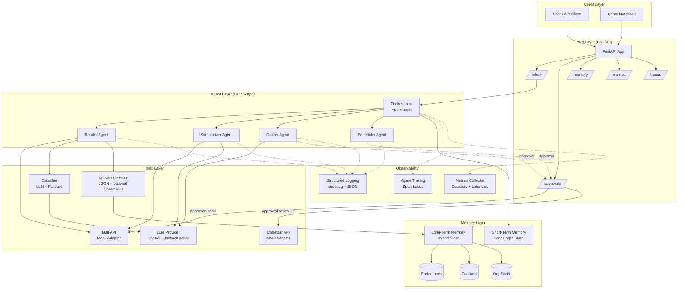
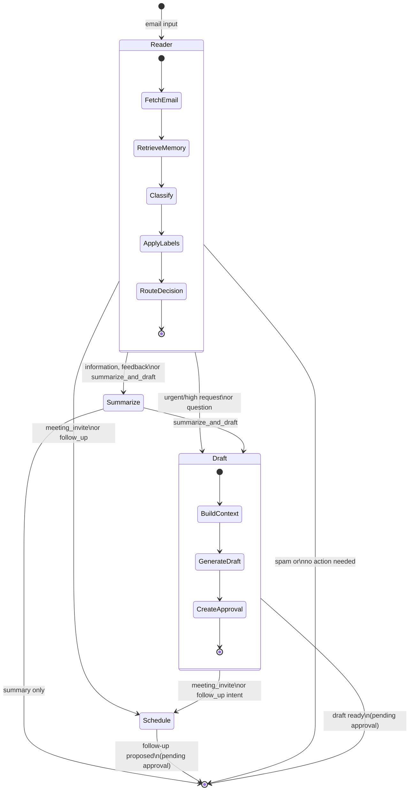
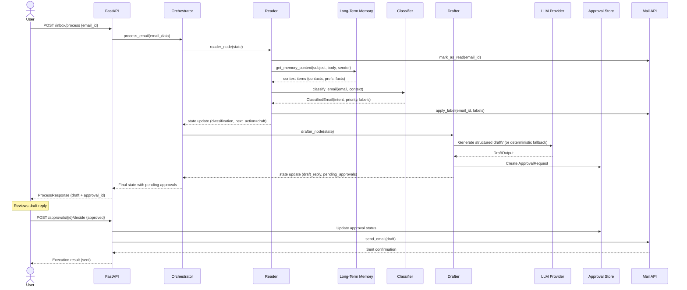
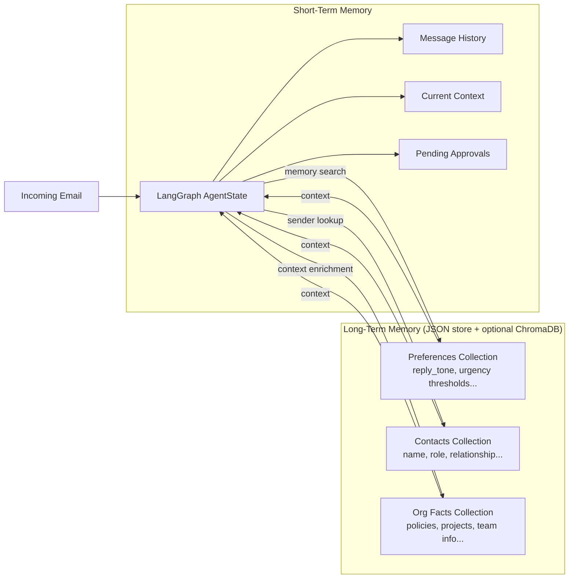

# Architecture

## High-Level System Architecture

```mermaid
graph TB
    subgraph "Client Layer"
        UI[User / API Client]
        NB[Demo Notebook]
    end

    subgraph "API Layer (FastAPI)"
        API[FastAPI App]
        INB[/inbox/]
        APR[/approvals/]
        MEM[/memory/]
        MET[/metrics/]
        TRC[/traces/]
    end

    subgraph "Agent Layer (LangGraph)"
        ORC[Orchestrator<br/>StateGraph]
        RDR[Reader Agent]
        SUM[Summarizer Agent]
        DRF[Drafter Agent]
        SCH[Scheduler Agent]
    end

    subgraph "Tools Layer"
        MAIL[Mail API<br/>Mock Adapter]
        CAL[Calendar API<br/>Mock Adapter]
        CLS[Classifier<br/>LLM + Fallback]
        LLM[LLM Provider<br/>OpenAI + fallback policy]
        KS[Knowledge Store<br/>JSON + optional ChromaDB]
    end

    subgraph "Memory Layer"
        STM[Short-Term Memory<br/>LangGraph State]
        LTM[Long-Term Memory<br/>Hybrid Store]
        LTM_P[(Preferences)]
        LTM_C[(Contacts)]
        LTM_O[(Org Facts)]
    end

    subgraph "Observability"
        LOG[Structured Logging<br/>structlog + JSON]
        TRACE[Agent Tracing<br/>Span-based]
        METRICS[Metrics Collector<br/>Counters + Latencies]
    end

    UI --> API
    NB --> API
    API --> INB
    API --> APR
    API --> MEM
    API --> MET
    API --> TRC

    INB --> ORC
    ORC --> RDR
    ORC --> SUM
    ORC --> DRF
    ORC --> SCH

    RDR --> MAIL
    RDR --> CLS
    RDR --> KS
    SUM --> MAIL
    CLS --> LLM
    SUM --> LLM
    DRF --> LLM

    DRF -.->|approval| APR
    SCH -.->|approval| APR
    APR -->|approved send| MAIL
    APR -->|approved follow-up| CAL

    KS --> LTM
    LTM --> LTM_P
    LTM --> LTM_C
    LTM --> LTM_O
    ORC --> STM

    RDR -.-> LOG
    SUM -.-> LOG
    DRF -.-> LOG
    SCH -.-> LOG
    ORC -.-> TRACE
    ORC -.-> METRICS
```

## LangGraph State Machine

```mermaid
stateDiagram-v2
    [*] --> Reader: email input

    Reader --> Draft: urgent/high request\nor question
    Reader --> Summarize: information, feedback\nor summarize_and_draft
    Reader --> Schedule: meeting_invite\nor follow_up
    Reader --> [*]: spam or\nno action needed

    Summarize --> Draft: summarize_and_draft
    Summarize --> [*]: summary only

    Draft --> Schedule: meeting_invite\nor follow_up intent
    Draft --> [*]: draft ready\n(pending approval)

    Schedule --> [*]: follow-up proposed\n(pending approval)

    state Reader {
        [*] --> FetchEmail
        FetchEmail --> RetrieveMemory
        RetrieveMemory --> Classify
        Classify --> ApplyLabels
        ApplyLabels --> RouteDecision
        RouteDecision --> [*]
    }

    state Draft {
        [*] --> BuildContext
        BuildContext --> GenerateDraft
        GenerateDraft --> CreateApproval
        CreateApproval --> [*]
    }
```

## Sequence Diagram: Email Triage → Draft → Approve

```mermaid
sequenceDiagram
    actor User
    participant API as FastAPI
    participant ORC as Orchestrator
    participant RDR as Reader
    participant MEM as Long-Term Memory
    participant CLS as Classifier
    participant DRF as Drafter
    participant LLM as LLM Provider
    participant APR as Approval Store
    participant MAIL as Mail API

    User->>API: POST /inbox/process {email_id}
    API->>ORC: process_email(email_data)

    ORC->>RDR: reader_node(state)
    RDR->>MAIL: mark_as_read(email_id)
    RDR->>MEM: get_memory_context(subject, body, sender)
    MEM-->>RDR: context items (contacts, prefs, facts)
    RDR->>CLS: classify_email(email, context)
    CLS-->>RDR: ClassifiedEmail(intent, priority, labels)
    RDR->>MAIL: apply_label(email_id, labels)
    RDR-->>ORC: state update (classification, next_action=draft)

    ORC->>DRF: drafter_node(state)
    DRF->>LLM: Generate structured draft\n(or deterministic fallback)
    LLM-->>DRF: DraftOutput
    DRF->>APR: Create ApprovalRequest
    DRF-->>ORC: state update (draft_reply, pending_approvals)

    ORC-->>API: Final state with pending approvals
    API-->>User: ProcessResponse (draft + approval_id)

    Note over User: Reviews draft reply

    User->>API: POST /approvals/{id}/decide {approved}
    API->>APR: Update approval status
    API->>MAIL: send_email(draft)
    MAIL-->>API: Sent confirmation
    API-->>User: Execution result (sent)
```

## Memory Architecture

```mermaid
graph LR
    subgraph "Short-Term Memory"
        direction TB
        STM[LangGraph AgentState]
        MSG[Message History]
        CTX[Current Context]
        PEN[Pending Approvals]
        STM --> MSG
        STM --> CTX
        STM --> PEN
    end

    subgraph "Long-Term Memory (JSON store + optional ChromaDB)"
        direction TB
        PREF[Preferences Collection<br/>reply_tone, urgency thresholds...]
        CONT[Contacts Collection<br/>name, role, relationship...]
        ORGF[Org Facts Collection<br/>policies, projects, team info...]
    end

    EMAIL[Incoming Email] --> STM
    STM -->|memory search| PREF
    STM -->|sender lookup| CONT
    STM -->|context enrichment| ORGF
    PREF -->|context| STM
    CONT -->|context| STM
    ORGF -->|context| STM
```

